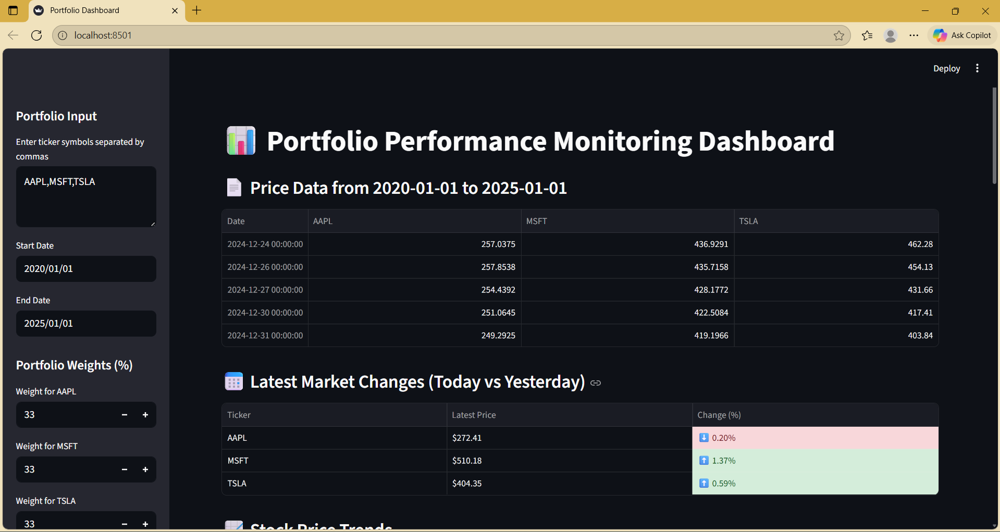
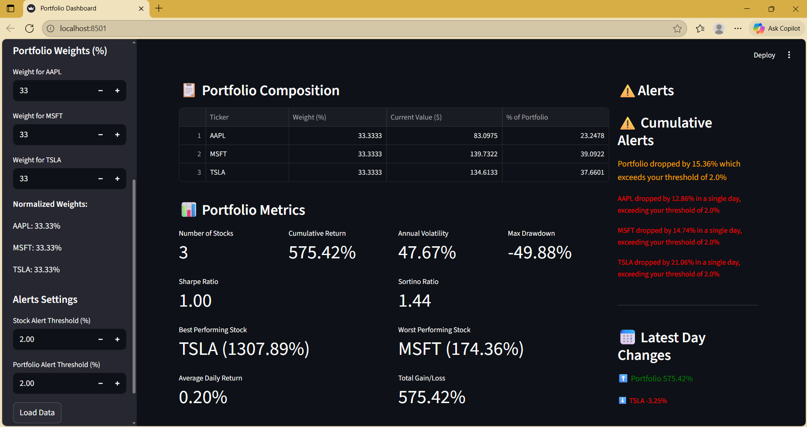
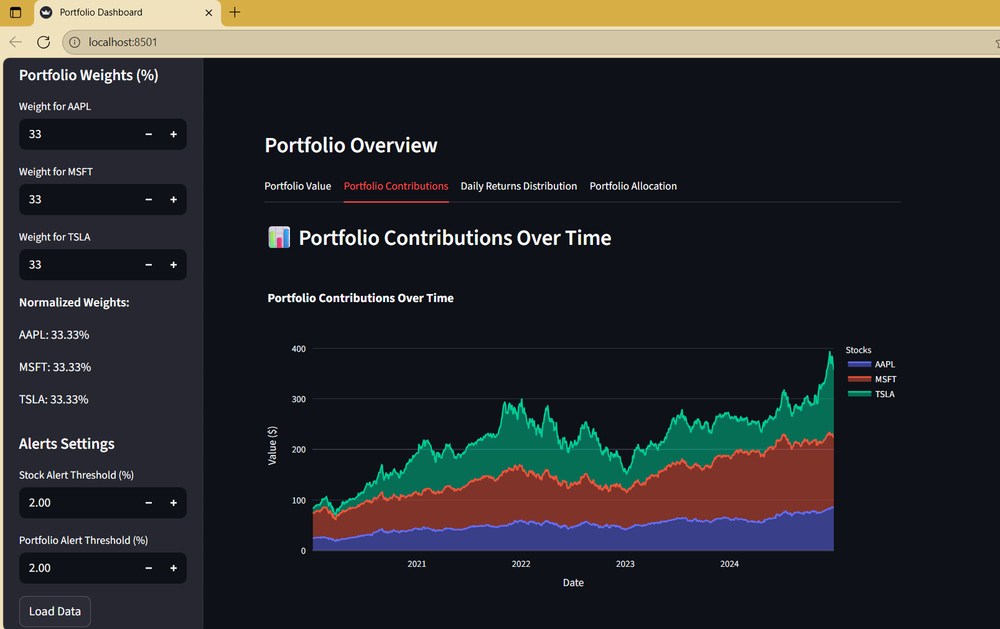

# Portfolio Performance Monitoring Dashboard

A Streamlit-based web application for tracking, analyzing, and visualizing investment portfolio performance.
The dashboard provides real-time insights with key metrics, interactive charts, and alert mechanisms — ideal for investors, analysts, and data science learners.

---

## Features

### Performance Metrics

The dashboard calculates and displays:

- Daily returns
- Cumulative return
- Annualized volatility
- Sharpe ratio
- Max drawdown
- Individual stock performance
- Portfolio allocation

---

## Visualizations

Interactive Streamlit charts:

- Portfolio value over time
- Daily return trend
- Rolling volatility
- Maximum drawdown
- Stock allocation bar chart
- Individual stock price trends

All visuals update automatically based on selected tickers and date range.

---

## Alert Mechanism

The dashboard provides warnings when:

- A stock drops more than **X%** in a single day
- Portfolio value falls below a threshold
- Custom rule-based triggers activate

Alerts appear as Streamlit warning/info messages.

---

## Project Structure

portfolio_performance_monitoring_likhith/
│── app.py
│── requirements.txt
│── README.md
│
├── utils/
│    ├── data_loader.py
│    ├── metrics.py
│    ├── charts.py
│    └── alerts.py
│
└── screenshots/
      ├── Dashboard.png
      ├── PerformanceMetrics_Alerts.png
      └── VisualizationTabs.png

---

## How It Works

### Data Loading

- Uses **yfinance** to fetch historical market data
- Cleans and structures time-series data
- Supports multiple tickers at once

### Metrics Engine

The `portfolio.py` module calculates:

- Daily percentage returns
- Cumulative returns
- Annualized volatility (252 trading days)
- Sharpe ratio
- Drawdown and max drawdown

### Charting Layer

Using Streamlit’s chart components:

- Line charts
- Area charts
- Bar charts
- Rolling-window metrics
- CandleStick

### Alerts

The `alerts.py` module evaluates conditions such as:

- Price drop thresholds
- Drawdown limits
- User-defined triggers

---

## Technologies Used

- **Python**
- **Streamlit**
- **Pandas**
- **NumPy**
- **yfinance**

## Screenshots

### Dashboard Home

### Performance Metrics and Alerts

### Visualizations

---

## Future Improvements

- Email/SMS notifications
- Efficient frontier portfolio optimization
- Database integration (PostgreSQL / MongoDB)
- User authentication and profiles
